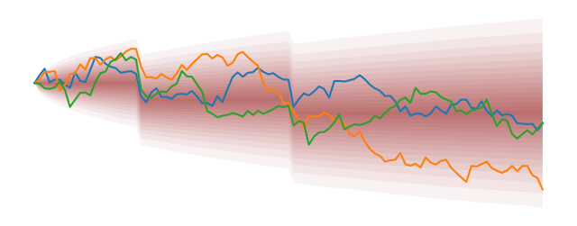

# What is finmc?

The `finmc` package contains Monte-Carlo implementations of many financial models derived from a common interface class. This interface allows computation of instruments with european, and american payoffs, as well as path dependent calculations.

<figure markdown="1">
  
</figure>

## Why do we need a common interface?

 - [Plots and other utilities](./utilities.md) shared by all models.
 - [Price Calculators](./calculators.md) are model invariant.
 - Interace designed for high performance with a large number of paths.
 - [Many new models](models/api.md/#mc-models-in-other-repos) outside this package, by indepedent contributors, and yet compatible with above utilities and calculators.

## Getting started.

Install it from PyPI

```bash
pip install finmc
```


This is an example of pricing a vanilla option using the local volatility model.

```py
import numpy as np
from finmc.models.localvol import LVMC
from finmc.calc.option import opt_price_mc

# Define Dataset with zero rate curve, and forward curve.
dataset = {
    "MC": {"PATHS": 100_000, "TIMESTEP": 1 / 250},
    "BASE": "USD",
    "ASSETS": {
        "USD":("ZERO_RATES", np.array([[2.0, 0.05]])),
        "SPX": ("FORWARD", np.array([[0.0, 5500], [1.0, 5600]])),
        },
    "LV": {"ASSET": "SPX", "VOL": 0.3},
}

model = LVMC(dataset)
price = opt_price_mc(5500.0, 1.0, "Call", "SPX", model)
```

## Learn More
- [Dataset](./dataset.md) creation guide
- [Models](./models/heston.md) included in the package