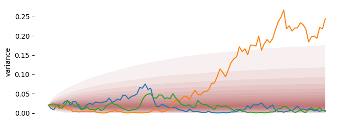

### Model

<figure markdown="1">
  
</figure>

In the Heston model  the lognormal stock process \(X_t\) is given by,

$$
dX_t = (\mu - \frac{\nu_t}{2}) dt + \sqrt \nu_t dW_s
$$

and the variance follows the process
$$
d \nu_t = \kappa (\theta - \nu_t) dt + \xi \sqrt \nu_tdW_t
$$

where \(dW_s\) and \(dW_t\) are Wiener processes with correlation \(\rho\).

### Dataset

The model specific component in the dataset (`HESTON`) is a dict with the following parameters:

* ASSET: the name of the asset
* INITIAL_VAR: the initial variance \(\nu_0\)
* LONG_VAR: the long variance \(\theta\)
* VOL_OF_VOL: the volatility of the volatility \(\xi\)
* MEANREV: the mean reversion rate \(\kappa\)
* CORRELATION: the correlation \(\rho\)


### Example

```python
from finmc.models.heston import HestonMC

heston_params = {
    "ASSET": "SPX",
    "INITIAL_VAR": 0.015,
    "LONG_VAR": 0.052,
    "VOL_OF_VOL": 0.88,
    "MEANREV": 2.78,
    "CORRELATION": -0.85,
}
```

```python
dataset = {
    "MC": {"PATHS": 100_000, "TIMESTEP": 1 / 250},
    "BASE": "USD",
    "ASSETS": {
        "USD": ("ZERO_RATES", np.array([[2.0, 0.05]])),
        "SPX": ("FORWARD", np.array([[0.0, 5500], [1.0, 5600]])),
    },
    "HESTON": heston_params
}
model = HestonMC(dataset)
model.advance(1.0)
spots = model.get_value("SPX")

```

See [complete example here](https://github.com/finlib/finmc/blob/main/notebooks/heston.ipynb)
