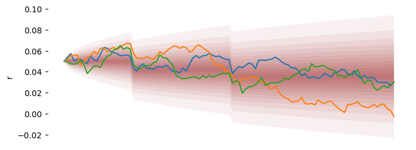

# Hull-White

<figure markdown="1">
  
</figure>

### Model

In the Hull White model, the short-rate follows the following process.
$$
dr_t = [\theta_t - a r_t]dt + \sigma dW_t
$$

where \(dW_t\) is a Wiener process.

### Dataset

The model specific component in the dataset (`HW`) is a dict with the following parameters:

* ASSET: the name of the asset
* MEANREV: the mean reversion rate \(a\)
* VOL: the volatility of rate \(\sigma\)


Note: \(\theta_t\) is calibrated by the model from the zero rate curve.

### Example

```python
from finmc.models.hullwhite import HullWhiteMC

dataset = {
    "MC": {"PATHS": 100_000, "TIMESTEP": 1 / 250, "SEED": 1},
    "BASE": "USD",
    "ASSETS": {"USD": ("ZERO_RATES", np.array([[2.0, 0.05]]))},
    "HW": {
        "ASSET": "USD",
        "MEANREV": 0.1,
        "VOL": 0.03,
    },
}

model = HullWhiteMC(dataset)
model.advance(1.0)
discount_factors = model.get_df()
```

See [complete example here](https://github.com/finlib/finmc/blob/main/notebooks/hullwhite.ipynb)
