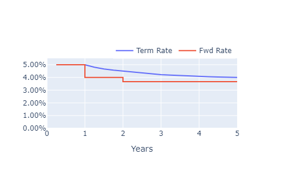

# Rates



You can describe the base asset using a two-column (N X 2) numpy array, where the first column is time, and the second represents **term zero rates**, e.g.

```
[[1.   0.05]
 [2.   0.045]
 [5.   0.04]]
```

It can be created like

```python
discount_data = ("ZERO_RATES", np.array([[1.0, .05], [5.0, 0.04]]))
dataset = {
    "BASE": "USD",
    "ASSETS": {"USD": discount_data},
}
```

Or alternatively, using `np.column_stack` from two arrays

```python
times = np.array([1.0, 2.0, 5.0])
rates = np.array([0.05, 0.045, 0.04])
discount_data = ("ZERO_RATES", np.column_stack((times, rates)))
```

For complete dataset see [dataset](dataset.md)